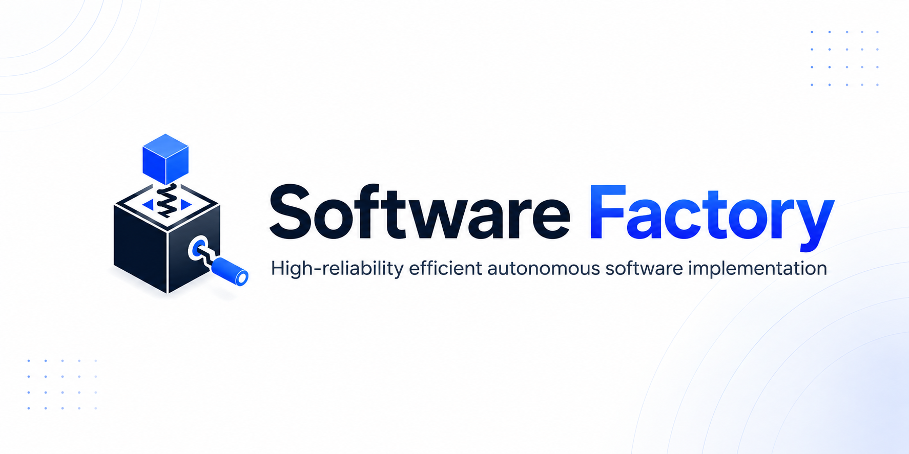
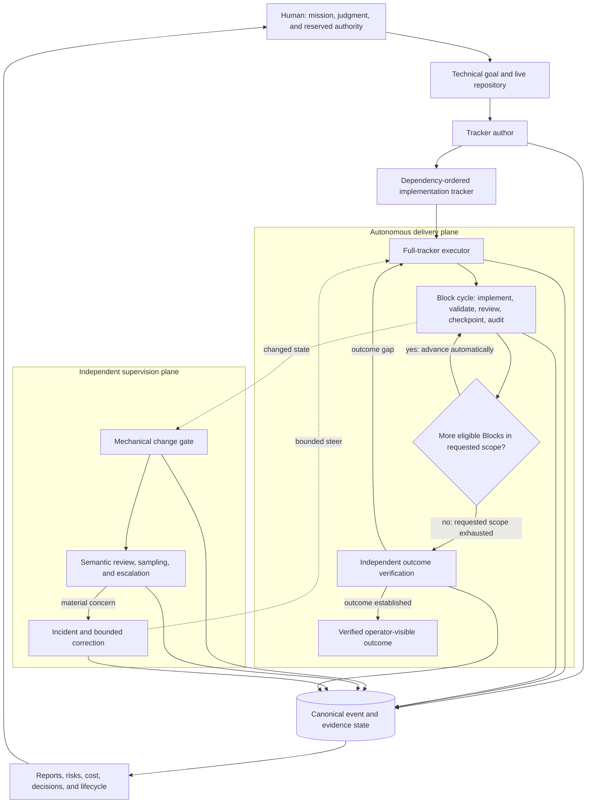
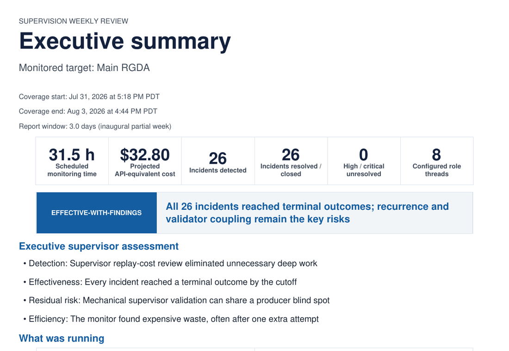

> **Software Factory is a high-reliability agent harness for autonomous software implementation with Codex.** It turns a technical objective and live repository into a verified, dependency-ordered implementation program and executes the requested scope across hours or days with minimal routine human intervention.
>
> An independent control plane detects, contains, and drives recovery from feature creep, inefficient implementation, circular validation, stale state, false workflow stops, incomplete outcome closure, and other agent failure modes. It verifies corrective outcomes and the final operator-visible result, then produces evidence-backed operational reports.

_"Everything I've been doing to get Codex to do production-worthy work, but now automated"_ -- Ethan Stillman (@estill01), Software Factory Floor Manager

## Demonstrated operation

| Autonomous scope | Runtime | Final validation | Independent supervision |
|---|---:|---|---|
| **65 Blocks (0–64)** | **~4 days** | **279 passing tests; 0 open Critical or High findings** | **156 semantic reviews; 26 / 26 incidents reached terminal outcomes** |

A single requested scope covered the complete tracker without turn-by-turn Block scheduling or re-prompting. Projected API-equivalent cost for the included **71.42-hour** supervision window was **$32.80**.

[**Watch the walkthrough**](https://www.youtube.com/watch?v=gRJ-hgbBcTo) · [**Open the generated supervision report**](examples/reports/software_factory_report.pdf) · [**Quick start**](#quick-start) · [**Architecture**](#architecture) · [**Changelog**](CHANGELOG.md) · [**Full evidence and limitations**](#full-demonstrated-operation)

## System at a glance

Software Factory combines three composable Codex skills with deterministic tracker verification, canonical event and incident state, weekly and terminal reporting, PDF rendering, and focused tests for the control invariants.

| Layer | Primary component | Responsibility |
|---|---|---|
| **Specification** | [`author-implementation-trackers`](author-implementation-trackers/) | Derive an implementation program from the live repository and its authoritative owners; define outcome, scope, dependencies, non-goals, acceptance, evidence, resource posture, decision boundaries, and terminal criteria. |
| **Autonomous execution** | [`implement-tracker-blocks`](implement-tracker-blocks/) | Execute one Block, a dependency-safe range, or the entire remaining tracker; validate, review, checkpoint, audit, and advance automatically through dependency order. |
| **Independent supervision** | [`supervise-tracker-runs`](supervise-tracker-runs/) | Perform mechanical change gating, independent semantic review, escalation, sampling, incident adjudication, bounded steering, and correction-effectiveness review. |
| **Outcome closure** | Executor and supervisor terminal controls | Reconcile the requested capability, protected behavior, architecture level, accepted tradeoffs, current behavior, and operator-visible effects; reopen only the narrow owner when a green process record and the actual outcome disagree. |
| **Human governance** | Reports, lifecycle state, notices, decision packets, and optional Gmail | Present status, cost, response time, recurrence, blind spots, risks, and outcome evidence without requiring a human to read the full agent transcript. |

The skills remain independently useful: author a tracker without implementing it, execute a constrained Block range, run an entire compatible tracker without independent supervision, or attach supervision to a multi-day implementation program.

## Project history and changelog

[`CHANGELOG.md`](CHANGELOG.md) is the maintained human-consumable history of
significant planned, implemented, demonstrated, corrected, and removed Software
Factory capabilities. Update it when a coherent change materially affects a
reusable capability, public workflow, authority boundary, compatibility
posture, or major implementation program. It need not repeat every test,
fixture, review, or evidence-only checkpoint.

Git history, tracker completion evidence, canonical supervision events, and
verified machine-readable reports remain the high-precision underlying data.
The changelog summarizes those sources and cites exact revisions where useful;
it never upgrades a plan, experiment, or process record into implemented or
operator-visible behavior.

## Quick start

### 1. Install the skills

This repository is a **reference Codex skill tree**, not a packaged hosted
service or plugin. Installed behavior is pinned to an accepted immutable local
release; editing a checkout does not update the live skills.

```bash
git clone https://github.com/estill01/software-factory.git
cd software-factory
/usr/bin/python3 scripts/skill_release.py --help
```

Promote one exact clean commit with the repository's fixed test suites. The
command validates all three skills, runs their tests, seals the release, swaps
one pointer atomically, verifies the installed roots in a fresh process, and
restores the prior pointer automatically if verification fails:

```bash
/usr/bin/python3 scripts/skill_release.py promote \
  --repo "$PWD" \
  --source-commit "$(git rev-parse HEAD)"
```

On a new installation, `promote` establishes the three stable discovery links
through the single release-root `current` pointer. On later runs it never
rewrites those links; it replaces only
`~/.codex/software-factory-releases/current`.

```bash
/usr/bin/python3 scripts/skill_release.py status
/usr/bin/python3 scripts/skill_release.py rollback
```

An already-loaded Codex task continues with the instructions it loaded before
the swap; start a new task or restart Codex after activation. The helper proves
a fresh filesystem resolution but does not claim a transactional multi-skill
snapshot inside an already-running host. Exact state, manifest fields, failure
posture, and migration details are in
[`docs/software-factory-skill-releases.md`](docs/software-factory-skill-releases.md).
The guide also documents the optional signed-review and signed-cutover mode for
cases that deliberately require separation of duties. It is not required for
ordinary local skill maintenance.

Directly symlinking the three discovery paths to a mutable checkout is an
explicit **development-live/unsafe mode**. It is useful only when immediate
instruction changes are intentionally desired and is not the default install
or release workflow.

Invoke the installed skills as `$author-implementation-trackers`,
`$implement-tracker-blocks`, and `$supervise-tracker-runs`. See the
[Codex Skills documentation](https://developers.openai.com/codex/build-skills)
for current discovery behavior.

### 2. Choose the operating mode

| Goal | Invocation | Behavior |
|---|---|---|
| Turn a technical objective into an executable implementation program | `$author-implementation-trackers` | Inspect the repository, derive the architecture-aware tracker, verify its structural invariants, and stop before implementation. |
| Execute the entire remaining tracker | `$implement-tracker-blocks` | Advance automatically through every eligible Block until outcome closure or a genuine non-delegable boundary. |
| Execute one Block or a bounded range | `$implement-tracker-blocks` with exact scope | Preserve the same evidence and acceptance controls, then stop at the requested boundary. |
| Add independent monitoring and incident follow-through | `$supervise-tracker-runs` from a separate thread | Observe changed state, review independently, route bounded correction, and verify later outcomes. |
| Run the complete system | Author → execute and supervise → verify outcome | Keep routine production autonomous while preserving human mission, reserved authority, and final oversight. |

### 3. Confirm the operating requirements

| Capability | Requirements |
|---|---|
| **Tracker authoring and execution** | Codex with local Skills support; Git; Python 3; `uv` for the fixed automated release checks; a repository Codex can inspect and modify. OpenSSL is needed only for the optional signed release mode. |
| **Independent supervision and reporting** | Python 3.11+ in a POSIX environment; independent Codex-thread access; scheduled automation or heartbeat support; access to the roles named by the supervision policy; `reportlab` for PDF generation |
| **Optional communication** | Gmail for project-scoped alerts, decision packets, roundups, replies, and report delivery; email is not required for authoring, execution, local incident state, or report generation |

```bash
python3 -m pip install reportlab
```

Review the environment-specific model aliases, schedules, and runtime bindings in the supervision policy before deploying the complete supervisor outside the reference environment.

### 4. Use a copyable prompt

#### Author an implementation tracker

```text
$author-implementation-trackers

{technical objective}
```

#### Execute the entire remaining tracker

```text
$implement-tracker-blocks {path/to/tracker}
```

#### Execute one Block or a bounded range

```text
$implement-tracker-blocks implement {Block N / Blocks N-M} {path/to/tracker.md}
```

#### Attach independent supervision

Run in a side chat:

```text
$supervise-tracker-runs
```

Run in a dedicated Task:

```text
$supervise-tracker-runs {session ID}
```

## Architecture



| Plane | Owns | Authority boundary |
|---|---|---|
| **Delivery** | Repository-aware implementation, validation, review, checkpointing, audit, and automatic advancement across the requested tracker scope | Does not redefine the mission or use process evidence alone to certify the final outcome |
| **Supervision** | Changed-state review, incident detection, escalation, bounded steering, sampling, and later correction-effectiveness review | Observes and steers; it does not take over ordinary implementation or rewrite the user's mission |
| **Evidence and human control** | Canonical events, incidents, policy state, deterministic metrics, evidence-bound synthesis, and verified report projections | Compresses supported state for governance; it does not turn attractive narration into a second source of truth |

## Operating model

| Stage | System contract | Completion gate |
|---|---|---|
| **1. Author** | Inspect the repository and convert the objective into dependency-ordered Blocks with owned scope, non-goals, deliverables, acceptance criteria, evidence, economy posture, decision boundaries, and stop conditions. | A maintained verifier confirms the tracker's structural invariants; implementation has not begun. |
| **2. Execute** | Reconstruct each eligible Block from live state, implement the smallest missing delta, validate and review the exact candidate, record evidence, checkpoint the slice, audit it, and advance automatically. | The current Block is accepted at its boundary; the executor activates the next eligible Block or begins terminal outcome verification. |
| **3. Supervise** | Route materially changed states through mechanical gating, independent semantic review, escalation and sampling, incident adjudication, bounded correction, and later effectiveness review. | A no-intervention state is supported, or the incident reaches a later evidence-backed terminal outcome. |
| **4. Close and report** | Return to the original objective, inspect or rehydrate current deliverables, reconcile requested and protected capabilities with the selected architecture level, accepted tradeoffs, current behavior, and visible effects, challenge open items and artifact currentness, and project canonical evidence into reports. | The operator-visible capability exists as requested; otherwise only the narrow owning work is reopened. |

### Full-tracker execution loop

```text
bind original outcome-closure contract
        ↓
reconstruct current eligible Block
        ↓
inspect live repository and Git state
        ↓
identify smallest missing delta
        ↓
reuse current accepted evidence
        ↓
implement only the Block's owned scope
        ↓
validate and obtain required independent review
        ↓
record exact evidence and checkpoint the candidate
        ↓
audit and close the Block at its boundary
        ↓
requested scope complete?
   ├── no: activate the next eligible Block automatically
   └── yes: independently verify the operator-visible outcome
```

The Block stop boundary prevents scope bleed. It is an internal acceptance boundary, not necessarily a human handoff. A full-tracker run closes the current Block, rereads the next contract and live dependencies, and continues automatically.

When a narrow input is genuinely unresolved, the executor computes the affected dependency closure and continues the maximal safe-work frontier. One missing decision does not become a global stop unless the dependency graph actually requires it.

## Reliability model

| Production failure mode | Control applied by Software Factory |
|---|---|
| **A Block boundary becomes a human scheduling gate.** | Requested scope and Block control scope are represented separately, so full-tracker runs advance automatically after each accepted Block. |
| **A source task hands off to a successor and treats the handoff as completion.** | The append-only successor-transition state machine preserves tracker, mission, authority, task, binding, acknowledgement, and first-Block start identity; source stop remains prohibited until current `work-started` evidence exists. |
| **An implementation owner stops after one internal Block despite a standing full-tracker request.** | The canonical implementation-range binding preserves the original direct scope across renumbering and task/run/group boundaries; every Block Stop recomputes the ready frontier, and lifecycle/final-answer gates classify an early return as critical until all requested Blocks and the current outcome reconcile. |
| **Successor, decision, lifecycle, stop, and completion records imply conflicting terminal states.** | One governing-outcome reducer owns the posture. A content-minimized public-gate replay plus a 60-case finite state matrix proves deterministic precedence, actionable reconciliation for invalid terminal claims, same-task continuation after direct correction, and zero ordinary human scheduling. |
| **The agent treats a task list as the architecture.** | Tracker authoring inspects the live repository, identifies authoritative owners, and splits work at real dependency, mutation, review, recovery, and stopping boundaries. |
| **Scope expands into attractive but unnecessary infrastructure.** | Every Block has one primary outcome, explicit non-goals, a feature-creep test, and a stop clause. |
| **Tests pass, so the project is declared complete.** | Tests, commits, hashes, audits, and ledgers remain process evidence; terminal closure separately inspects operator-visible deliverables and expected effects. |
| **A learning experiment is populated, so its candidate is promoted.** | The derived packet is independently evaluated and dispositioned, but adoption remains separately governed and terminal closure still reconciles the actual product capability. |
| **Producer and validator share the same blind spot.** | Mechanical checks are separated from semantic review that can reconstruct governing facts independently, with escalation and sampling. |
| **The run repeatedly rescans or rebuilds unchanged work.** | Cheap currentness checks, accepted-evidence reuse, preflight, batching, and targeted invalidation precede expensive proof. |
| **One unresolved decision stalls everything.** | A genuine decision becomes a bounded dependency cut and the safe-work frontier is computed around it. |
| **A corrective action certifies itself.** | Incidents remain open until later target evidence shows whether the correction worked. |
| **A failure is recorded but cannot be compared or prevented later.** | Incident-owned failure-mode envelopes preserve the causal layer, mechanism, trigger, effect, detection, correction, recurrence invariant, and human-scheduling leak without creating a second ledger. |
| **The human must read thousands of agent turns to understand the run.** | Canonical event state is converted into deterministic metrics, evidence-bound synthesis, and verified human-readable reports. |

The result is **human-in-the-loop without requiring a human in every loop**: people retain mission, judgment, reserved authority, and final oversight while the machinery handles routine decomposition, execution control, changed-state review, incident follow-through, and reporting.

The three installed Software Factory skills are pinned through one immutable
accepted release set and one atomically replaced `current` pointer. The active
local release `b7269cc0d71f-eb1269660b3e` resolves exact reviewed roots for all
three skills; its content-identical baseline remains accepted for rollback.
Already-loaded tasks retain the instructions they loaded before a swap, while
new skill resolutions traverse the stable links into the active release.

## Human control and reporting

The human interface is not the raw agent transcript. The reporting path deliberately separates computation, interpretation, and presentation.

| Layer | Function | Result |
|---|---|---|
| **Canonical operational state** | Preserve implementation, review, incident, lifecycle, policy, and reporting events with exact provenance. | Machine-readable source state |
| **Deterministic computation** | Compute bounded metrics, incident heads, activity, schedule posture, role counts, currentness, and resource estimates before narrative interpretation. | Canonical report data |
| **Evidence-bound cognitive review** | Interpret recurrence, blind spots, correction effectiveness, operating efficiency, supervisor behavior, and limitations without replacing the underlying evidence. | Supported synthesis |
| **Verified projections** | Render the same report state into JSON, Markdown, and charted PDF and verify agreement across projections. | Human-readable control surface |

At accepted terminal completion, the system can produce both:

| Report | Question answered |
|---|---|
| **Delta report** | What happened during the final reporting interval? |
| **Full-run report of reports** | What happened from implementation inception through accepted completion? |

Together they answer two separate questions:

1. **Did the resulting software satisfy the mission?**
2. **What happened inside the factory while producing it?**

## Repository map

| Path | Purpose |
|---|---|
| [`author-implementation-trackers/`](author-implementation-trackers/) | Tracker-authoring skill, agent definitions, references, assets, structural verifier, and verifier tests |
| [`implement-tracker-blocks/`](implement-tracker-blocks/) | Single-Block, bounded-range, and full-tracker execution contract plus supporting agent definitions |
| [`supervise-tracker-runs/`](supervise-tracker-runs/) | Independent supervision skill, role definitions, maintained policy, canonical event and incident tooling, weekly and terminal reporting, PDF rendering, and focused tests |
| [`examples/reports/software_factory_report.pdf`](examples/reports/software_factory_report.pdf) | Complete generated human-facing supervision report |
| [`examples/reports/software_factory_report_preview.png`](examples/reports/software_factory_report_preview.png) | Page-one README preview linked to the full report |
| [`README.md`](README.md) | System overview, operating model, architecture, evidence, and usage guidance |

Local supervision runtime state, generated Python bytecode, and Codex-managed system skills are intentionally excluded from version control.

## Development validation

```bash
SKILL_VALIDATOR="${CODEX_HOME:-$HOME/.codex}/skills/.system/skill-creator/scripts/quick_validate.py"

python3 "$SKILL_VALIDATOR" ./author-implementation-trackers
python3 "$SKILL_VALIDATOR" ./implement-tracker-blocks
python3 "$SKILL_VALIDATOR" ./supervise-tracker-runs
```

### Bounded adaptive-protocol dogfood

The repository includes one small, reproducible matrix for the demonstrated
adaptive implementation paths:

```bash
/usr/bin/python3 implement-tracker-blocks/scripts/adaptive_protocol_dogfood.py --pretty
```

It exercises an ordinary-target inline correction, selective bounded candidate
comparison and retirement, exceptional structural routing, Software Factory
self-work, the cheap justified-no-change path, full-autonomous ordinary work,
narrow reserved-external deferral, and maintained recovery cases. The output
separates opaque raw comparison inputs from observed dispositions and includes
executed temporary-target bytes/output, an applied reviewed structural revision
with automatic resume, current protocol roots, normal-owner handoffs, bounded
usage, accepted-Block remediation, all four adaptive authority modes, and the
aggregate human-request count. The exact result projection excludes volatile
temporary paths and commit identities, so a frozen checkout or Git-less archive
regenerates the same rooted evidence.

This is a live-behavior evidence runner confined to disposable repositories. It
applies and executes only the temporary target corrections needed to prove the
current effects. It does not apply a live handoff, cut over or adopt a live
candidate, edit the governing tracker, mutate global configuration, release a
skill, or perform an external action. Its bounded cases demonstrate the
documented envelope only; they are not a statistical benchmark or unlimited
autonomous authority. See
[`adaptive-protocol-dogfood.md`](implement-tracker-blocks/references/adaptive-protocol-dogfood.md)
for the evidence and review boundary.

### Integrated Factory-evolution dogfood

The terminal paired matrix exercises the coupled within-run and cross-run loops
through the production supervision CLI while keeping every effect inside one
disposable Git target and one disposable release owner:

```bash
uv run --python 3.14 python \
  supervise-tracker-runs/scripts/factory_evolution_dogfood.py \
  --pretty \
  --output /tmp/software-factory-integrated-dogfood-result.json \
  --evidence-output /tmp/software-factory-integrated-dogfood-evidence.json
```

It advances one supported signal through packet preparation, independent
candidate review, the normal implementation owner, executed candidate and
incumbent proofs, sealed evaluation, temporary adoption, installed-behavior
observation, effective outcome, and consumed-input recurrence suppression. In
the same disposable target it retires one independently rejected candidate
without a second activation. It also invokes the three current stable skill
entrypoints, reuses the smaller adaptive-protocol matrix for all four authority
modes, and projects concise operator/report summaries separately from canonical
rooted evidence.

The default/stdout result is a closed, nonauthorizing semantic projection that
is byte-reproducible for one exact source and installed three-skill identity.
`--evidence-output` separately retains the exact high-precision run. Its
currentness and provenance roots intentionally include the disposable Git ref
and reflog filesystem identities and are therefore current and run-specific.
Before emitting the projection, the runner validates all raw root consistency
and every retained semantic leaf; it does not claim external authenticity for
the self-contained disposable evidence.

The result is a bounded demonstration, not a live release. Every live release,
policy, mission, lifecycle, Gmail, deployment, and external-effect flag remains
false. `promote` becomes authoritative only inside the temporary normal release
owner; the command cannot install to the live skill store. See
[`integrated-factory-evolution-dogfood.md`](supervise-tracker-runs/references/integrated-factory-evolution-dogfood.md)
for exact evidence, reproducibility, and independent-review requirements.

### Factory-evolution evidence admission

The supervision owner can admit one evidence-bound Factory-improvement
opportunity at three maintained checkpoints: explicit Factory maintenance,
terminal report verification, and weekly report finalization. The gate derives
novelty only from supported incident/gap records or independently verified
observable-outcome completion records, including recurring meta-signals backed
by two such exact outcomes. A generic positive label or praise-only check is
not productive evidence. Report identity, prose, checkpoint, and Factory
revision remain currentness context and cannot manufacture a second
opportunity.

Unchanged, unsupported, already-consumed, resource-exhausted, or conflicting
evidence is a deterministic no-op. Fixed mode does not build a packet;
recommend mode emits a nonauthorizing recommendation; reviewed-autonomous and
full-autonomous modes may retain one prepared admission for later governed
work. Admission never performs cognitive review, creates a candidate, writes a
target, or adopts an outcome. Operators can run the same bounded gate directly
with `supervision_log.py factory-evolution --action admit`; status and verified
weekly projections expose the current result without turning report prose into
authority.

Once admitted, `factory-evolution --action orchestrate` records one exact
packet-to-reviewer handoff and, after review finalization, one deterministic
candidate-type-to-normal-owner handoff. The authoring, implementation, or
supervision owner—not the evolution helper—creates the isolated candidate.
That direct candidate commit binds the canonical owner-handoff record.
`--action acknowledge --owner-ack-json <ack.json>` then reopens the current Git
revision, executes the changed focused owner tests from its bounded archive,
requires one distinct executed test for every protected capability, enforces
one handoff-to-proof deadline, and derives exact scope, budget, validation,
protected-capability, provenance, and Stop evidence. The input does not supply
outcomes or owner claims. Only a current bounded candidate reaches comparison.
One further `orchestrate` call runs the declared mapped incumbent proof and
records the exact nonauthorizing evaluator handoff. The sealed evaluator
interface is preflighted first. A canonical comparison-start event makes a
missing completed result fail closed; the completed result binds that start's
record identity, root, and chronology, so pre-start bytes reject. A per-cycle
owner lock plus an
owner-authenticated, file-and-directory-synced pending result makes concurrent
or interrupted delivery reuse the one comparison. The handoff binds that
provenance, the fixed evaluator-key root, and exact target-owner ref plus
bounded reflog-file currentness, including same-HEAD events. A fixed-key
independent evaluator can then submit one signed, revision-bound disposition covering every
positive and exception case plus contrary and regression evidence. The
canonical result retains raw baseline/candidate roots and exposes `promote`
only as adoption eligibility. The incumbent remains authoritative during that
evaluation stage. A subsequent orchestration pass applies the configured
adoption policy: fixed/recommend/lower dispositions remain nonauthorizing, while
a current reviewed/full-autonomous winner with all existing release permissions
and exact external review/operator evidence can continue through the normal
atomic release owner. Any target
currentness loss during the handoff or evaluation append is canonically
corrected. The bound owner root keeps the stale source inactive even if that
correction is interrupted or the target transiently changes and returns.
The release owner also compares the frozen prior release ID and activation
history HMAC inside its activation lock, so intervening or A-to-B-to-A release
activity cannot be folded into an older adoption decision.

Each governed cycle then closes through one exact terminal outcome. An adopted
candidate requires the latest independently verified observable result for the
same evaluation and installed release; report prose or a `promote` disposition
cannot establish effectiveness. A supported later regression appends a
successor outcome, preserves the earlier effective record, and invokes the
normal release owner once to restore the frozen baseline under an exact
quiescent boundary. Interrupted rollback and outcome writes rehydrate without a
second owner effect, while release-currentness loss records a nonauthorizing
correction. Only the current terminal head consumes canonical admission
coverage. Unchanged or repackaged coverage stays closed; a newly nominated
canonical outcome/event may support one later bounded cycle. Existing weekly
and terminal JSON, Markdown, and PDF reports project concise outcome posture,
rollback, recurrence, and next-action summaries. No continuous monitor, score,
or learning database is added.

## Full demonstrated operation

The recorded implementation program and included supervision window show two complementary parts of the system. These are observations from specific runs, not general benchmarks for Codex or software engineering.

### Multi-day implementation run

A single requested scope covered the complete tracker from Block 0 through Block 64.

| Measure | Observed result |
|---|---:|
| Requested tracker scope | Blocks 0–64 |
| Blocks executed | **65** |
| Execution time | Approximately **4 days** |
| Operator posture | Minimal routine human intervention; no turn-by-turn Block scheduling or re-prompting |
| Final test suite | **279 passing tests** |
| Final audit | **0 open Critical or High findings** |

The executor implemented, validated, reviewed where required, checkpointed, audited, and advanced through the program without requiring a human to restart the loop after each Block.

### Independent supervision window

| Measure | Observed result |
|---|---:|
| Report window | **71.42 h** |
| Scheduled monitoring time | **31.49 h** |
| Recorded target-read reliability | **92.39%** |
| Configured role threads | **8** |
| Semantic reviews | **156** |
| Incidents detected | **26** |
| Incidents reaching terminal outcomes | **26 / 26** |
| Median detection-to-resolution | **0.71 h** |
| P90 detection-to-resolution | **4.97 h** |
| High or Critical unresolved at cutoff | **0** |
| Projected API-equivalent supervision cost | **$32.80** |

### Generated supervision report

[](examples/reports/software_factory_report.pdf)

*Generated operational report, not a design mockup. Click the preview to open [`examples/reports/software_factory_report.pdf`](examples/reports/software_factory_report.pdf).*

The report is the human control surface for the run: it summarizes monitoring coverage, cost posture, active roles, incidents, response time, effectiveness, recurring failure classes, known blind spots, and evidence boundaries without requiring transcript-level supervision.

The independent control plane found issues that ordinary completion signals would not have exposed:

| Finding | What the control plane established |
|---|---|
| **Unnecessary evidence replay** | Routine monitoring rebuilt a **2,134-file** evidence envelope despite a current frozen baseline. The normal path was moved to cheap revision and root checks, with deep verification retained for actual currentness changes. |
| **Circular validation** | Producer and mechanical validator agreed because they shared classification logic. Independent semantic reconstruction kept promotion closed and later verified the corrected successor. |
| **Stale role activation** | A policy-hash mismatch exposed stale automation and role prompts. The repair changed only stale references and preserved schedules and role identities. |
| **False workflow stop** | A narrow historical no-rerun instruction had drifted into a durable prohibition. Mission-provenance review restored ordinary successor work without rewriting the mistaken history. |

> [!NOTE]
> The cost figure is a versioned API-equivalent projection, not provider telemetry or billed usage. Incident closure does not prove non-recurrence, and the report does not by itself establish the substantive quality of the monitored implementation.
