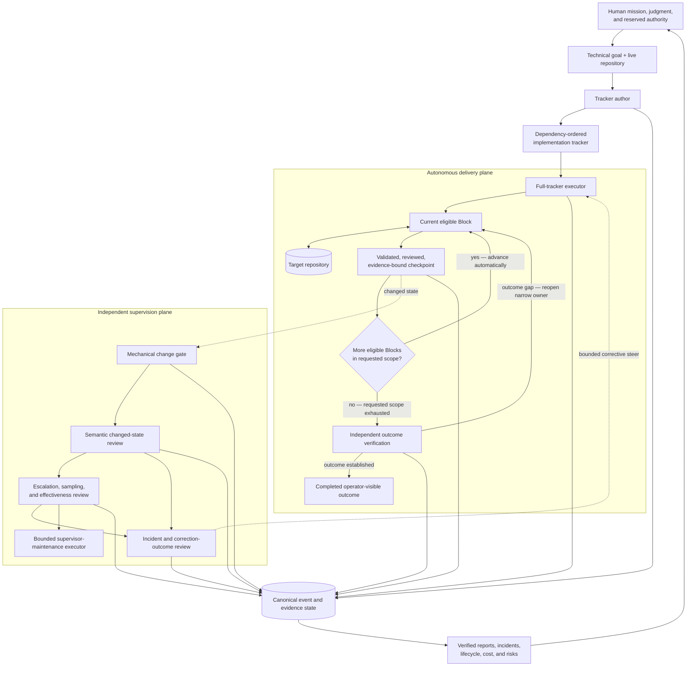

# Software Factory

**A fully-autonomous, high-reliability software factory for Codex. **

Software Factory takes a technical objective and a repository, turns them into a dependency-ordered implementation item tracker list, executes the entire tracker across hours or days, validates and checkpoints every implementation `Block`, independently supervises and corrects the run, and verifies the finished operator-visible outcome.

Software Factory is built for **unattended, end-to-end implementation runs**, not turn-by-turn pair programming. After an implementation tracker is authored, [`implement-tracker-blocks`](implement-tracker-blocks/) can take the whole program—not just one Block—and repeatedly:

```text
select the next eligible Block
        ↓
implement → validate → required review → checkpoint → audit
        ↓
advance automatically to the next Block
```

That loop can continue for days without a human re-prompting the agent after each Block. It stops only when the requested scope is exhausted and the original outcome has been verified, or when the system reaches a genuinely non-delegable authority, safety, credential, release, or external-dependency boundary. Ordinary engineering choices and Block transitions do not require the operator to keep pressing “continue.”

> **Demonstrated in practice:** one recorded run executed **65 Blocks over approximately four days, essentially unattended by a human**, finishing with **279 passing tests** and **no open Critical or High findings**.

The rest of the factory surrounds that autonomous execution loop with stronger controls. [`author-implementation-trackers`](author-implementation-trackers/) derives the implementation contract from the live repository. [`supervise-tracker-runs`](supervise-tracker-runs/) runs alongside the implementer as an independent control plane, monitoring changed state, detecting drift and avoidable work, routing bounded corrections, and generating evidence-bound reports for human governance.

**Block-by-Block is the factory’s control granularity, not its autonomy limit.** A user can ask the executor to run one Block, a dependency-safe range, or every remaining Block in the tracker.

```text
technical goal + live repository
        ↓
repository-derived implementation contract
        ↓
unattended multi-Block execution
implement → validate → review → checkpoint → advance
        ↕
independent supervision → incident → bounded correction
        ↓
verified operator-visible outcome
        ↓
evidence-bound reporting for human governance
```

[**Watch the video walkthrough**](https://www.youtube.com/watch?v=gRJ-hgbBcTo) · [**Open the generated supervision report**](examples/reports/software_factory_report.pdf)

---

## What the factory provides

Software Factory combines three composable Codex skills with deterministic verification, event, incident, and reporting machinery. Together they support long-running, end-to-end tracker execution; separately, each can be used for a narrower job.

| Layer | Skill / output | Responsibility |
|---|---|---|
| **Specification** | [`author-implementation-trackers`](author-implementation-trackers/) | Convert a technical goal and the live repository into a dependency-ordered implementation program with explicit ownership, scope, non-goals, acceptance, evidence, resource posture, decision boundaries, and terminal outcome criteria. |
| **Autonomous execution** | [`implement-tracker-blocks`](implement-tracker-blocks/) | Execute one Block, a range, or the entire remaining tracker. For a full run, repeat implementation, validation, required review, checkpointing, pushing when permitted, audit, and automatic advancement in dependency order until outcome closure or a real authority boundary. |
| **Independent supervision** | [`supervise-tracker-runs`](supervise-tracker-runs/) | Observe changed states from separate role threads, perform semantic review, detect incidents and waste, route bounded corrections, challenge completion, and evaluate the supervisor itself. |
| **Human control and observability** | Reports, incident notices, lifecycle state, and optional Gmail delivery | Project machine-readable evidence into status, risks, cost, response times, recurring failure classes, known blind spots, and current outcome evidence a human can govern without reading the full agent transcript. |

The name `implement-tracker-blocks` describes the **unit of control**, not the maximum run length. “One bounded Block at a time” means each Block is independently reconstructed, implemented, proven, audited, and closed before the executor activates the next eligible Block. It does **not** mean the user must issue a new prompt for every Block.

The skills remain composable. You can author a tracker without implementing it, execute a single Block for a constrained change, run an entire compatible tracker without supervision, or attach independent supervision to a multi-day implementation run.

The repository is more than three instruction files: it includes deterministic tracker verification, supervision event and incident machinery, weekly and terminal reporting, PDF rendering, and focused tests for the control invariants.

---

## What the factory controls during an autonomous run

| Production risk | Control applied by Software Factory |
|---|---|
| **The agent treats a task list as the architecture.** | Tracker authoring inspects the live repository, identifies authoritative owners, and splits work at real dependency, mutation, review, recovery, and stopping boundaries. |
| **Scope expands into attractive but unnecessary infrastructure.** | Every Block has one primary outcome, explicit non-goals, a feature-creep test, and a stop clause that excludes downstream work. |
| **Tests pass, so the agent declares the project complete.** | Tests, commits, hashes, audits, and ledgers remain supporting process evidence. Terminal completion requires inspection or reconstruction of the actual operator-visible deliverables and expected effects. |
| **Producer and validator share the same blind spot.** | Mechanical checks are separated from semantic review that reconstructs the governing facts independently, with higher-reasoning escalation and sampling. |
| **The run repeatedly rescans, rebuilds, or revalidates unchanged work.** | The execution contract requires cheap currentness checks, reuse of accepted evidence, preflight before expensive work, batching, and recomputation only where a successor change invalidated proof. |
| **One unresolved decision stalls everything.** | A genuine decision is treated as a bounded dependency cut. The system computes the safe-work frontier, continues independent work, and escalates only information or authority the agent cannot supply. |
| **A correction is treated as self-proving.** | Incidents remain open until later target evidence shows whether the correction actually worked; issuing a steer does not close its own incident. |
| **The human must read thousands of agent turns to know what happened.** | Canonical event state is converted into deterministic metrics, evidence-bound cognitive review, and verified human-readable reports. |

The result is **human-in-the-loop without requiring a human in every loop**: people retain mission, judgment, reserved authority, and final oversight while the machinery handles routine decomposition, execution control, changed-state review, incident follow-through, and reporting.

---

## Architecture



The key separation is between:

1. **defining what must become true;**
2. **autonomously executing the full dependency-ordered program;**
3. **judging changed state and corrective outcomes;**
4. **establishing that the requested outcome actually exists;** and
5. **explaining the production system to a human.**

Those functions share evidence, but they do not silently collapse into one self-certifying authority.

### Autonomous delivery plane

The user can request a single Block, a dependency-safe range, or the entire tracker. In a full-tracker run, the executor maintains the governing outcome-closure contract and repeats the same controlled cycle across every eligible Block: reconstruct the live Block, identify the smallest missing delta, implement it, validate the frozen candidate, obtain distinct review where required, record exact evidence, create a bounded Git checkpoint, push when an existing configured remote and repository policy permit it, audit the Block, and activate the next eligible Block automatically.

The explicit Block stop boundary prevents scope bleed: Block N cannot quietly absorb Block N+1. It is **not** necessarily a human pause. When the requested scope includes later Blocks, the executor closes the current Block at its boundary, rereads the next Block and live dependencies, and continues. This is what allows a controlled implementation program to run unattended for hours or days while retaining narrow acceptance and recovery points.

### Independent supervision plane

The supervisor runs outside the implementation thread. A low-cost watcher performs mechanical change detection; materially changed states are routed to an independent semantic reviewer; consequential concerns, selected no-intervention states, checkpoints, and supervisor-effectiveness questions can be escalated for deeper review. Material problems become explicit incidents with deduplicated state, bounded corrective steering, and later effectiveness review.

The supervisor observes and steers. It does not take over ordinary target implementation or use its own records to redefine the user's mission.

### Evidence and human-control plane

Implementation, review, incident, lifecycle, policy, and reporting events are maintained as canonical operational evidence. Deterministic tooling computes the metrics first; an evidence-bound cognitive review then interprets patterns such as recurrence, blind spots, correction effectiveness, operating cost, and machinery changes. The same canonical report state is projected into verified JSON, Markdown, and PDF outputs rather than allowing a polished report to become a second source of truth.

---

## Demonstrated operation

### Full-tracker implementation run

A recorded implementation program used `implement-tracker-blocks` to execute the entire tracker—not a single isolated Block—through 65 bounded implementation and acceptance cycles.

| Measure | Observed result |
|---|---:|
| Requested tracker scope | **Blocks 0–64** |
| Blocks executed | **65** |
| Execution time | **Approximately 4 days** |
| Operator posture | **Essentially unattended; no turn-by-turn Block scheduling** |
| Final test suite | **279 passing tests** |
| Final audit | **0 open Critical or High findings** |

The executor implemented, validated, reviewed where required, checkpointed, audited, and advanced across the program without requiring a human to manually restart the loop after each Block. These are observations from one recorded run, not a general benchmark for Codex or software engineering.

### Generated independent-supervision report

The repository includes the human-readable report generated by the supervision system for one inaugural partial-week monitoring window:

[**Open `examples/reports/software_factory_report.pdf` →**](examples/reports/software_factory_report.pdf)

| Measure | Observed result |
|---|---:|
| Report window | **71.42 h** |
| Scheduled monitoring time | **31.49 h** |
| Recorded target-read reliability | **92.39%** |
| Configured role threads | **8** |
| Semantic reviews | **156** |
| Incidents detected | **26** |
| Incidents reaching terminal outcomes | **26 / 26** |
| Median detection-to-resolution | **0.71 h** |
| P90 detection-to-resolution | **4.97 h** |
| High / Critical unresolved at cutoff | **0** |
| Projected API-equivalent supervision cost | **$32.80** |

More important than the counts is what the independent control plane caught:

- **Unnecessary evidence replay:** ordinary monitoring was rebuilding a 2,134-file evidence envelope even though the frozen baseline was still current. The correction moved the normal path to cheap revision and root checks while retaining a deep check when currentness changes.
- **Circular validation:** producer and mechanical validator initially agreed because they shared the same classification logic. Independent semantic review reconstructed the governing facts, kept promotion closed, and later verified the corrected successor.
- **Stale role activation:** a policy-hash mismatch prevented an incorrect review, exposed stale automation prompts, and enabled a narrow repair that preserved schedules and role identities.
- **False workflow stop:** mission-provenance review determined that a narrow historical no-rerun instruction had been incorrectly promoted into a durable prohibition, restored ordinary successor work, and preserved the mistaken history rather than rewriting it.

The report is deliberately self-critical. It distinguishes incident closure from recurrence, notes that some catches occurred after a live effect, and treats zero formally classified false positives as insufficient proof that the supervisor never oversteered.

The supervision numbers describe one recorded monitoring window. The cost figure is a versioned API-equivalent projection, not provider telemetry or billed usage, and the report does not by itself establish the substantive quality of the monitored implementation.

---

## How the workflow operates

### 1. Author an implementation contract

[`author-implementation-trackers`](author-implementation-trackers/) converts an objective into an implementation-ready program another agent can execute without inventing the architecture as it goes.

The tracker defines:

- the primary outcome and observable completion condition;
- the existing architecture and authoritative owners to reuse;
- predecessor work to reuse, adapt, remediate, replace, retire, or reject;
- dependency-ordered Blocks split at real ownership and acceptance boundaries;
- scope, non-goals, deliverables, acceptance criteria, negative tests, and stopping conditions;
- evidence/currentness rules and the distinction between mechanical proof, substantive judgment, external approval, and release or legal status;
- economical execution paths for expensive scans, renders, model work, or validation; and
- the exact circumstances in which human input is genuinely non-delegable.

A maintained verifier checks structural invariants before the tracker is handed to implementation.

### 2. Execute the full tracker, Block by Block

[`implement-tracker-blocks`](implement-tracker-blocks/) accepts a single Block, a dependency-safe range, or the entire remaining tracker. In full-tracker mode it turns the tracker into a long-running, evidence-bound execution loop:

```text
bind the original outcome-closure contract
        ↓
reconstruct the current eligible Block
        ↓
inspect live repository and Git state
        ↓
identify the smallest missing delta
        ↓
reuse current accepted evidence
        ↓
implement only the Block's owned scope
        ↓
focused validation and allowed mutating review
        ↓
freeze exact candidate
        ↓
mapped proof + required independent review
        ↓
record current evidence + checkpoint/push when permitted
        ↓
audit and close the current Block at its boundary
        ↓
requested scope complete?
   ├── no: activate the next eligible Block automatically
   └── yes: independently verify the actual operator-visible outcome
```

The stop boundary is an **internal acceptance boundary**, not a requirement for a human handoff. For a one-Block request, the executor stops there. For a range or full tracker, it closes the Block cleanly, rereads the next contract and dependencies, and continues without asking the operator to schedule the next unit.

When a narrow input is genuinely unresolved, the executor computes the blocked dependency closure and continues the maximal safe-work frontier instead of converting one missing answer into a global stop. It reports **implementation completion** and **outcome completion** separately, so a green tracker cannot manufacture success when a required artifact, installation, publication, or operator-visible effect is still missing.

### 3. Attach independent supervision

[`supervise-tracker-runs`](supervise-tracker-runs/) creates an isolated supervision group for an active implementation thread. The maintained policy defines role prompts, cadence, mission binding, sampling, escalation, incident lifecycle, decision handling, notification gates, weekly reporting, and terminal shutdown requirements.

At a high level:

```text
changed target state
        ↓
mechanical change gate
        ↓
independent semantic review
        ↓
no intervention ─────────────┐
        │                     │ sampled as configured
        └─ material concern   ↓
                 ↓       deeper independent review
          incident opened
                 ↓
        bounded correction
                 ↓
        later target evidence
                 ↓
      resolved / still open / escalated
```

Supervision can also produce periodic and terminal reports, evaluate recurrence and supervisor oversteer, and optionally deliver alerts, decision packets, roundups, replies, and reports through project-scoped Gmail threads.

### 4. Close against the original outcome

When the tracker is exhausted, the system returns to the governing objective. It rehydrates or directly inspects current operator-visible deliverables, reconciles expected effects against actual effects, verifies artifact currentness, challenges retained open items, and rejects terminal completion when the real outcome and the green process record disagree.

At accepted completion, the supervision system can generate both:

- a **delta report** covering the final reporting interval; and
- a **full-run report of reports** covering the implementation from inception through completion.

This answers two different questions: **Did the resulting software satisfy the mission?** and **What happened inside the factory while producing it?**

---

## Quick start

### Use the right amount of factory

| Goal | Use |
|---|---|
| Turn an ambiguous technical goal into an executable implementation program | `$author-implementation-trackers` |
| Run an entire tracker end to end, essentially unattended | `$implement-tracker-blocks` over all remaining eligible Blocks |
| Restrict execution to one Block or a dependency-safe range | `$implement-tracker-blocks` with the exact requested scope |
| Add independent monitoring, incident handling, correction follow-through, and reporting | `$supervise-tracker-runs` from a separate thread |
| Run the complete system | author → full-tracker execution + independent supervision → outcome verification |

<details>
<summary><strong>Copyable prompt templates</strong></summary>

### Author a tracker

```text
Use $author-implementation-trackers.

Inspect this repository and turn the following goal into an implementation-ready
tracker. Reuse the existing architecture and owners. Define observable completion,
dependency-ordered Blocks, scope and non-goals, acceptance criteria, evidence,
economical validation, independent-review boundaries, decision boundaries, and
explicit stop conditions. Do not implement the tracker.

Goal: <technical objective>
Tracker path: <path/to/tracker.md>
```

### Run the entire tracker autonomously

```text
Use $implement-tracker-blocks to implement and audit the entire tracker at:

<path/to/tracker.md>

Start with the first incomplete eligible Block and continue through every remaining
Block in dependency order.

For each Block, reconstruct the live contract, implement the complete owned delta,
run focused and mapped validation, obtain distinct review where required, bind all
evidence to the exact candidate, create a bounded checkpoint commit, push when an
existing configured remote and repository policy permit it, audit the Block, and
then automatically advance to the next eligible Block.

Do not pause for confirmation between Blocks. Treat each Block boundary as an
internal scope and acceptance boundary, not a user scheduling gate. Do not stop for
ordinary engineering choices or generic reassurance. If a genuinely non-delegable
input affects only part of the tracker, preserve that bounded subject as waiting and
continue the maximal safe-work frontier.

Continue until the requested tracker scope is exhausted and the original
operator-visible outcome has been independently verified, or until a real authority,
safety, credential, release, destructive-action, or external-dependency boundary
prevents further safe work. Do not merge, release, open a pull request, or perform
destructive cleanup unless separately authorized.
```

### Run only one Block or a bounded range

```text
Use $implement-tracker-blocks to implement and audit <Block N / Blocks N-M> from:

<path/to/tracker.md>

Follow the tracker exactly, preserve unrelated work, reuse current accepted evidence,
bind validation and review to the exact candidate revision, checkpoint the bounded
slice when appropriate, and stop when the requested Block or range is complete. Do
not advance beyond the requested scope.
```

### Attach supervision from a separate Codex thread

```text
Use $supervise-tracker-runs.

Attach bounded supervision to the active implementation-tracker thread for this
project. Resolve the exact target thread, bind the current mission, monitor materially
changed states, route independent semantic review, detect drift and avoidable cost,
manage incidents through later outcome evidence, and keep the target thread as the
implementation authority. Keep Gmail integrations off unless explicitly enabled.
```

### Generate a report

```text
Use $supervise-tracker-runs to generate and verify an on-demand supervision
performance report for the current bounded reporting window.
```

</details>

---

## Installation and requirements

This repository is currently a **reference Codex skill tree**, not a packaged hosted service or plugin.

Clone the repository, then expose the three top-level skill directories through a Codex-discovered location. For a user-wide local install, symlink them into `~/.agents/skills`:

```bash
git clone https://github.com/estill01/software-factory.git
cd software-factory
mkdir -p "$HOME/.agents/skills"

ln -s "$(pwd)/author-implementation-trackers" \
  "$HOME/.agents/skills/author-implementation-trackers"
ln -s "$(pwd)/implement-tracker-blocks" \
  "$HOME/.agents/skills/implement-tracker-blocks"
ln -s "$(pwd)/supervise-tracker-runs" \
  "$HOME/.agents/skills/supervise-tracker-runs"
```

Codex also supports repository-local `.agents/skills/` directories and explicit skill paths in `skills.config`. Invoke the skills with `$author-implementation-trackers`, `$implement-tracker-blocks`, and `$supervise-tracker-runs` while evaluating the system. Codex normally detects skill changes automatically; restart it if an update does not appear. See the [Codex Skills documentation](https://developers.openai.com/codex/build-skills) for current discovery and configuration behavior.

The core authoring and implementation workflow requires:

- Codex with local Skills support;
- Git;
- Python 3; and
- a repository Codex can inspect and modify.

The full reference supervision system additionally assumes:

- Python 3.11+ in a POSIX environment;
- the ability to create and read independent Codex threads;
- scheduled automation / heartbeat support;
- access to the model roles named by the current supervision policy; and
- [`reportlab`](https://pypi.org/project/reportlab/) for PDF generation.

```bash
python3 -m pip install reportlab
```

Gmail is optional. Tracker authoring, Block implementation, local incident state, and report generation do not require email delivery. The current supervision policy contains environment-specific model aliases, schedules, and runtime bindings; review and adapt those before deploying the complete supervisor outside the reference environment.

---

## Reliability principles

| Principle | Operational consequence |
|---|---|
| **Block boundaries are internal control points** | Full-tracker execution advances automatically after each accepted Block; the human is not the scheduler for routine transitions. |
| **Separate authorities** | Planning, implementation, supervision, correction review, and outcome verification do not silently collapse into one agent's declaration. |
| **Evidence outranks narration** | Claims resolve to current repository state, exact artifacts, tests, reviews, events, or operator-visible deliverables. |
| **Process proxies do not prove outcomes** | Tests, hashes, commits, audits, and complete ledgers support a conclusion but do not replace the requested result. |
| **Preserve provenance and currentness** | Accepted proof is bound to exact revisions and authority roots; later changes stale only affected evidence. |
| **Correct narrowly** | Contain the supported failure, preserve unaffected work, change the smallest responsible owner, and rerun only invalidated proof. |
| **Continue the safe frontier** | A bounded missing decision blocks only its dependency closure, not every independent slice of work. |
| **Require later correction evidence** | A fix attempt cannot certify itself or close its own incident. |
| **Observe the supervisor** | Detection quality, recurrence, timing, oversteer, cost, policy propagation, and machinery changes are themselves reviewed. |
| **Keep the human interface evidence-bound** | Reports compress canonical machine state; they do not create a competing status narrative. |

---

## Repository structure

```text
software-factory/
├── author-implementation-trackers/
│   ├── SKILL.md
│   ├── agents/
│   ├── assets/
│   ├── references/
│   └── scripts/
├── implement-tracker-blocks/
│   ├── SKILL.md
│   └── agents/
├── supervise-tracker-runs/
│   ├── SKILL.md
│   ├── agents/
│   ├── references/
│   └── scripts/
│       ├── supervision_log.py
│       ├── weekly_report.py
│       ├── terminal_report.py
│       └── test_*.py
├── examples/
│   └── reports/
│       └── software_factory_report.pdf
└── README.md
```

Local supervision runtime state, generated Python bytecode, and Codex-managed system skills are intentionally excluded from version control.

---

