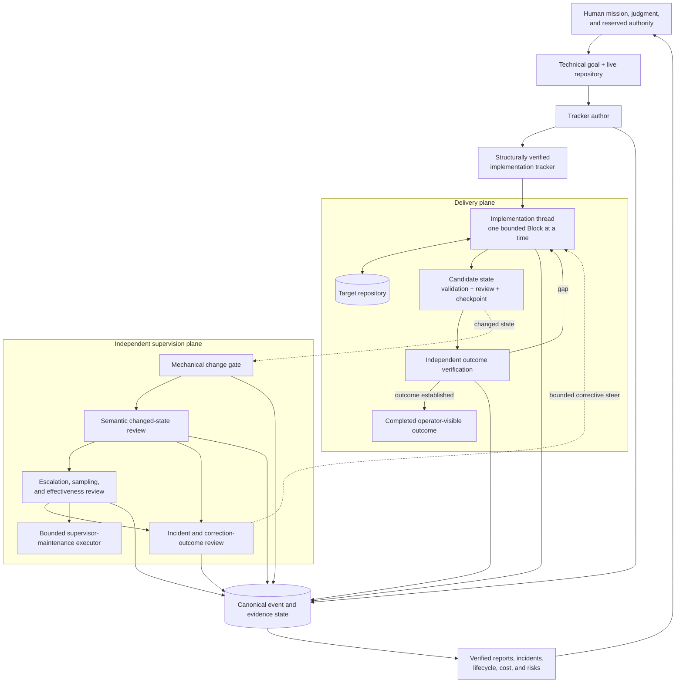

# Software Factory

**A high-reliability agent harness for Codex: specify, implement, independently supervise, correct, and verify software work as an evidence-bound production process.**

Coding models can produce code quickly. The harder problem is keeping a multi-hour or multi-day implementation run aligned with the actual goal, bounded to the right architecture, economical in its use of validation and model work, independently reviewed, and legible to a human.

Software Factory acts as the implementation operating system and control plane around the coding agent. It turns a technical objective and a live repository into a dependency-ordered implementation program, executes that program one bounded Block at a time, observes changed state from a separate supervision plane, routes narrow corrections when necessary, and verifies the operator-visible outcome rather than accepting process activity as proof of completion.

It is designed to let coding agents run longer and do more of the mechanical production work without turning the human into the scheduler, watchdog, retry loop, or sole source of assurance.

It is not a single agent asked to plan, build, test, review, and certify its own work.

```text
goal + repository
        ↓
structurally verified implementation contract
        ↓
bounded execution + exact evidence
        ↓
independent changed-state supervision
        ↓
verified operator-visible outcome
        ↓
evidence-bound human reporting
```

[**Watch the video walkthrough**](https://www.youtube.com/watch?v=gRJ-hgbBcTo) · [**Open the generated supervision report**](examples/reports/software_factory_report.pdf)

---

## What the factory provides

Software Factory is implemented as three composable Codex skills plus a human-facing reporting layer:

| Layer | Skill / output | Responsibility |
|---|---|---|
| **Specification** | [`author-implementation-trackers`](author-implementation-trackers/) | Convert a goal and the live repository into dependency-ordered Blocks with explicit ownership, scope, non-goals, acceptance, evidence, resource posture, and stop boundaries. |
| **Execution** | [`implement-tracker-blocks`](implement-tracker-blocks/) | Implement and audit one bounded Block at a time, preserve unrelated work and current proof, checkpoint exact revisions, and stop at the declared boundary. |
| **Independent supervision** | [`supervise-tracker-runs`](supervise-tracker-runs/) | Observe changed states from separate role threads, perform semantic review, detect incidents and waste, route bounded corrections, challenge completion, and evaluate the supervisor itself. |
| **Human control and observability** | Reports, incident notices, lifecycle state, and optional Gmail delivery | Project machine-readable evidence into status, risks, cost, response times, recurring failure classes, known blind spots, and current outcome evidence a human can govern. |

The skills can be used independently. You can author a tracker without implementing it, execute a compatible tracker without supervision, or attach supervision as a separate control plane to an active implementation run.

The repository is more than three instruction files: it includes deterministic tracker verification, supervision event and incident machinery, weekly and terminal reporting, PDF rendering, and focused tests for the control invariants.

---

## Why this is different

| Common failure in long-running agentic development | Software Factory response |
|---|---|
| **The agent treats a task list as the architecture.** | Tracker authoring inspects the live repository, identifies authoritative owners, and splits work at real dependency, mutation, review, recovery, and stopping boundaries. |
| **Scope expands into attractive but unnecessary infrastructure.** | Every Block has one primary outcome, explicit non-goals, a feature-creep test, and a stop clause that excludes downstream work. |
| **Tests pass, so the agent declares the project complete.** | Tests, commits, hashes, audits, and ledgers remain supporting process evidence. Terminal completion requires inspection or reconstruction of the actual operator-visible deliverables and expected effects. |
| **Producer and validator share the same blind spot.** | Mechanical checks are separated from semantic review that reconstructs the governing facts independently, with higher-reasoning escalation and sampling. |
| **The run repeatedly rescans, rebuilds, or revalidates unchanged work.** | The execution contract requires cheap currentness checks, reuse of accepted evidence, preflight before expensive work, batching, and recomputation only where a successor change invalidated proof. |
| **One unresolved decision stalls everything.** | A genuine decision is treated as a bounded dependency cut. The system computes the safe-work frontier, continues independent work, and escalates only information or authority the agent cannot supply. |
| **A correction is treated as self-proving.** | Incidents remain open until later target evidence shows whether the correction actually worked; issuing a steer does not close its own incident. |
| **The human must read thousands of agent turns to know what happened.** | Canonical event state is converted into deterministic metrics, evidence-bound cognitive review, and verified human-readable reports. |

The result is **human-in-the-loop without requiring a human in every loop**: people retain mission, judgment, reserved authority, and final oversight while the machinery handles routine decomposition, execution control, changed-state review, incident follow-through, and reporting.

---

## Architecture



The key separation is between:

1. **defining what must become true;**
2. **doing the implementation work;**
3. **judging changed state and corrective outcomes;**
4. **establishing that the requested outcome actually exists;** and
5. **explaining the production system to a human.**

Those functions share evidence, but they do not silently collapse into one self-certifying authority.

### Delivery plane

The implementation tracker is the scope and completion contract; the live repository and its controlling instructions remain authoritative. The implementer activates only the requested Block or range, identifies the smallest missing delta, preserves unrelated user work, reuses still-current evidence, validates a frozen candidate, obtains distinct review where required, creates bounded Git checkpoints, and stops at the Block boundary.

### Independent supervision plane

The supervisor runs outside the implementation thread. A low-cost watcher performs mechanical change detection; materially changed states are routed to an independent semantic reviewer; consequential concerns, selected no-intervention states, checkpoints, and supervisor-effectiveness questions can be escalated for deeper review. Material problems become explicit incidents with deduplicated state, bounded corrective steering, and later effectiveness review.

The supervisor observes and steers. It does not take over ordinary target implementation or use its own records to redefine the user's mission.

### Evidence and human-control plane

Implementation, review, incident, lifecycle, policy, and reporting events are maintained as canonical operational evidence. Deterministic tooling computes the metrics first; an evidence-bound cognitive review then interprets patterns such as recurrence, blind spots, correction effectiveness, operating cost, and machinery changes. The same canonical report state is projected into verified JSON, Markdown, and PDF outputs rather than allowing a polished report to become a second source of truth.

---

## Demonstrated operation

The repository includes an example report generated by the supervision system from one inaugural partial-week run.

[](examples/reports/software_factory_report.pdf)

[**View the complete eight-page PDF report →**](examples/reports/software_factory_report.pdf)

### Observed supervision window

| Measure | Observed result |
|---|---:|
| Report window | **71.42 h** |
| Scheduled monitoring time | **31.49 h** |
| Recorded target-read reliability | **92.39%** |
| Configured role threads | **8** |
| Semantic reviews | **156** |
| Incidents detected | **26** |
| Incidents reaching terminal outcomes | **26 / 26** |
| Median detection-to-resolution | **0.71 h** |
| P90 detection-to-resolution | **4.97 h** |
| High / Critical unresolved at cutoff | **0** |
| Projected API-equivalent supervision cost | **$32.80** |

More important than the counts is what the independent control plane caught:

- **Unnecessary evidence replay:** ordinary monitoring was rebuilding a 2,134-file evidence envelope even though the frozen baseline was still current. The correction moved the normal path to cheap revision and root checks while retaining a deep check when currentness changes.
- **Circular validation:** producer and mechanical validator initially agreed because they shared the same classification logic. Independent semantic review reconstructed the governing facts, kept promotion closed, and later verified the corrected successor.
- **Stale role activation:** a policy-hash mismatch prevented an incorrect review, exposed stale automation prompts, and enabled a narrow repair that preserved schedules and role identities.
- **False workflow stop:** mission-provenance review determined that a narrow historical no-rerun instruction had been incorrectly promoted into a durable prohibition, restored ordinary successor work, and preserved the mistaken history rather than rewriting it.

The report is also deliberately self-critical. It distinguishes incident closure from recurrence, notes that some catches occurred after a live effect, and treats zero formally classified false positives as insufficient proof that the supervisor never oversteered.

These numbers describe one recorded run and the behavior of its monitoring system. They are not general benchmarks for Codex or software engineering. The cost figure is a versioned API-equivalent projection, not provider telemetry or billed usage, and the report does not by itself establish the substantive quality of the monitored implementation.

---

## How the workflow operates

### 1. Author an implementation contract

[`author-implementation-trackers`](author-implementation-trackers/) converts an objective into an implementation-ready program another agent can execute without inventing the architecture as it goes.

The tracker defines:

- the primary outcome and observable completion condition;
- the existing architecture and authoritative owners to reuse;
- predecessor work to reuse, adapt, remediate, replace, retire, or reject;
- dependency-ordered Blocks split at real ownership and acceptance boundaries;
- scope, non-goals, deliverables, acceptance criteria, negative tests, and stopping conditions;
- evidence/currentness rules and the distinction between mechanical proof, substantive judgment, external approval, and release or legal status;
- economical execution paths for expensive scans, renders, model work, or validation; and
- the exact circumstances in which human input is genuinely non-delegable.

A maintained verifier checks structural invariants before the tracker is handed to implementation.

### 2. Execute bounded Blocks

[`implement-tracker-blocks`](implement-tracker-blocks/) turns a selected Block into an evidence-bound execution loop:

```text
reconstruct Block contract
        ↓
inspect live repository and Git state
        ↓
identify the smallest missing delta
        ↓
reuse current accepted evidence
        ↓
implement only the owned scope
        ↓
focused validation and mutating review
        ↓
freeze exact candidate
        ↓
mapped proof + independent review
        ↓
record current evidence and checkpoint
        ↓
STOP at the Block boundary
```

The implementer reports **implementation completion** and **outcome completion** separately. A green tracker cannot manufacture success when a required artifact, installation, publication, or operator-visible effect is still missing.

### 3. Attach independent supervision

[`supervise-tracker-runs`](supervise-tracker-runs/) creates an isolated supervision group for an active implementation thread. The maintained policy defines role prompts, cadence, mission binding, sampling, escalation, incident lifecycle, decision handling, notification gates, weekly reporting, and terminal shutdown requirements.

At a high level:

```text
changed target state
        ↓
mechanical change gate
        ↓
independent semantic review
        ↓
no intervention ─────────────┐
        │                     │ sampled as configured
        └─ material concern   ↓
                 ↓       deeper independent review
          incident opened
                 ↓
        bounded correction
                 ↓
        later target evidence
                 ↓
      resolved / still open / escalated
```

Supervision can also produce periodic and terminal reports, evaluate recurrence and supervisor oversteer, and optionally deliver alerts, decision packets, roundups, replies, and reports through project-scoped Gmail threads.

### 4. Close against the original outcome

When the tracker is exhausted, the system returns to the governing objective. It rehydrates or directly inspects current operator-visible deliverables, reconciles expected effects against actual effects, verifies artifact currentness, challenges retained open items, and rejects terminal completion when the real outcome and the green process record disagree.

At accepted completion, the supervision system can generate both:

- a **delta report** covering the final reporting interval; and
- a **full-run report of reports** covering the implementation from inception through completion.

This answers two different questions: **Did the resulting software satisfy the mission?** and **What happened inside the factory while producing it?**

---

## Quick start

### Use the right amount of factory

| Goal | Use |
|---|---|
| Turn an ambiguous technical goal into an executable plan | `$author-implementation-trackers` |
| Implement one Block or a dependency-safe Block range | `$implement-tracker-blocks` |
| Add independent monitoring, incident handling, and reporting | `$supervise-tracker-runs` from a separate thread |
| Run the full workflow | author → implement + independent supervision → outcome verification |

<details>
<summary><strong>Copyable prompt templates</strong></summary>

### Author a tracker

```text
Use $author-implementation-trackers.

Inspect this repository and turn the following goal into an implementation-ready
tracker. Reuse the existing architecture and owners. Define observable completion,
dependency-ordered Blocks, scope and non-goals, acceptance criteria, evidence,
economical validation, independent-review boundaries, and explicit stop conditions.
Do not implement the tracker.

Goal: <technical objective>
Tracker path: <path/to/tracker.md>
```

### Implement a Block

```text
Use $implement-tracker-blocks to implement and audit Block <N> from
<path/to/tracker.md>.

Follow the tracker exactly, preserve unrelated work, reuse current accepted evidence,
bind validation and review to the exact candidate revision, checkpoint the bounded
slice when appropriate, update only current completion evidence, and stop at the
Block's explicit boundary. Do not advance to Block <N+1>.
```

### Attach supervision from a separate Codex thread

```text
Use $supervise-tracker-runs.

Attach bounded supervision to the active implementation-tracker thread for this
project. Resolve the exact target thread, bind the current mission, monitor materially
changed states, route independent semantic review, detect drift and avoidable cost,
manage incidents through later outcome evidence, and keep the target thread as the
implementation authority. Keep Gmail integrations off unless explicitly enabled.
```

### Generate a report

```text
Use $supervise-tracker-runs to generate and verify an on-demand supervision
performance report for the current bounded reporting window.
```

</details>

---

## Installation and requirements

This repository is currently a **reference Codex skill tree**, not a packaged hosted service or plugin.

Clone the repository, then expose the three top-level skill directories through a Codex-discovered location. For a user-wide local install, symlink them into `~/.agents/skills`:

```bash
git clone https://github.com/estill01/software-factory.git
cd software-factory
mkdir -p "$HOME/.agents/skills"

ln -s "$(pwd)/author-implementation-trackers" \
  "$HOME/.agents/skills/author-implementation-trackers"
ln -s "$(pwd)/implement-tracker-blocks" \
  "$HOME/.agents/skills/implement-tracker-blocks"
ln -s "$(pwd)/supervise-tracker-runs" \
  "$HOME/.agents/skills/supervise-tracker-runs"
```

Codex also supports repository-local `.agents/skills/` directories and explicit skill paths in `skills.config`. Invoke the skills with `$author-implementation-trackers`, `$implement-tracker-blocks`, and `$supervise-tracker-runs` while evaluating the system. Codex normally detects skill changes automatically; restart it if an update does not appear. See the [Codex Skills documentation](https://developers.openai.com/codex/build-skills) for current discovery and configuration behavior.

The core authoring and implementation workflow requires:

- Codex with local Skills support;
- Git;
- Python 3; and
- a repository Codex can inspect and modify.

The full reference supervision system additionally assumes:

- Python 3.11+ in a POSIX environment;
- the ability to create and read independent Codex threads;
- scheduled automation / heartbeat support;
- access to the model roles named by the current supervision policy; and
- [`reportlab`](https://pypi.org/project/reportlab/) for PDF generation.

```bash
python3 -m pip install reportlab
```

Gmail is optional. Tracker authoring, Block implementation, local incident state, and report generation do not require email delivery. The current supervision policy contains environment-specific model aliases, schedules, and runtime bindings; review and adapt those before deploying the complete supervisor outside the reference environment.

---

## Reliability principles

| Principle | Operational consequence |
|---|---|
| **Separate authorities** | Planning, implementation, supervision, correction review, and outcome verification do not silently collapse into one agent's declaration. |
| **Evidence outranks narration** | Claims resolve to current repository state, exact artifacts, tests, reviews, events, or operator-visible deliverables. |
| **Process proxies do not prove outcomes** | Tests, hashes, commits, audits, and complete ledgers support a conclusion but do not replace the requested result. |
| **Preserve provenance and currentness** | Accepted proof is bound to exact revisions and authority roots; later changes stale only affected evidence. |
| **Correct narrowly** | Contain the supported failure, preserve unaffected work, change the smallest responsible owner, and rerun only invalidated proof. |
| **Continue the safe frontier** | A bounded missing decision blocks only its dependency closure, not every independent slice of work. |
| **Require later correction evidence** | A fix attempt cannot certify itself or close its own incident. |
| **Observe the supervisor** | Detection quality, recurrence, timing, oversteer, cost, policy propagation, and machinery changes are themselves reviewed. |
| **Keep the human interface evidence-bound** | Reports compress canonical machine state; they do not create a competing status narrative. |

---

## Repository structure

```text
software-factory/
├── author-implementation-trackers/
│   ├── SKILL.md
│   ├── agents/
│   ├── assets/
│   ├── references/
│   └── scripts/
├── implement-tracker-blocks/
│   ├── SKILL.md
│   └── agents/
├── supervise-tracker-runs/
│   ├── SKILL.md
│   ├── agents/
│   ├── references/
│   └── scripts/
│       ├── supervision_log.py
│       ├── weekly_report.py
│       ├── terminal_report.py
│       └── test_*.py
├── examples/
│   └── reports/
│       ├── software_factory_report.pdf
│       └── software_factory_report_preview.png
└── README.md
```

Local supervision runtime state, generated Python bytecode, and Codex-managed system skills are intentionally excluded from version control.

---

## Development validation

Validate each maintained skill with the Codex skill validator, then run the focused helper tests:

```bash
SKILL_VALIDATOR="${CODEX_HOME:-$HOME/.codex}/skills/.system/skill-creator/scripts/quick_validate.py"

python3 "$SKILL_VALIDATOR" ./author-implementation-trackers
python3 "$SKILL_VALIDATOR" ./implement-tracker-blocks
python3 "$SKILL_VALIDATOR" ./supervise-tracker-runs

python3 ./author-implementation-trackers/scripts/test_verify_tracker.py -v
python3 ./supervise-tracker-runs/scripts/test_supervision_log.py -v
python3 ./supervise-tracker-runs/scripts/test_weekly_report.py -v
python3 ./supervise-tracker-runs/scripts/test_terminal_report.py -v
```

The verifier and tests establish the specific structural and control-system invariants they inspect. They do not independently prove the substantive correctness of every implementation produced through the factory.

---

## Scope and assurance boundaries

Software Factory is a Codex-native skill suite and reference control architecture. It is not a hosted CI/CD service, a universal software-quality score, or a guarantee that an autonomous agent cannot make mistakes.

Its evidence is deliberately bounded:

- scheduled monitoring time is not continuous process uptime;
- recorded target reads are not complete provider-availability telemetry;
- projected token and API-equivalent costs are not billed usage;
- incident rate measures supervision yield, not implementation quality;
- zero formally classified false positives does not prove zero supervisor oversteer;
- incident closure does not prove non-recurrence;
- cognitive review can synthesize evidence but does not establish causality merely by explaining a pattern; and
- operational completeness does not automatically establish technical, legal, release, or product adequacy.

Those limits are part of the architecture, not disclaimers around it. The project is designed to make agentic implementation more capable and more autonomous **without making either the work or the confidence claims opaque**.

---

## Recommended reading

1. [`author-implementation-trackers/SKILL.md`](author-implementation-trackers/SKILL.md) — goal decomposition, Block contracts, scope control, decision boundaries, and tracker verification.
2. [`implement-tracker-blocks/SKILL.md`](implement-tracker-blocks/SKILL.md) — bounded execution, evidence currentness, Git checkpoints, correction handling, and outcome closure.
3. [`supervise-tracker-runs/SKILL.md`](supervise-tracker-runs/SKILL.md) — supervision boot, role separation, incident lifecycle, reporting, lifecycle gates, and shutdown.
4. [`supervise-tracker-runs/references/supervision-policy.md`](supervise-tracker-runs/references/supervision-policy.md) — exact roles, cadence, mission binding, escalation, notification, and reporting contracts.
5. [`examples/reports/software_factory_report.pdf`](examples/reports/software_factory_report.pdf) — the human-facing supervision report generated from one recorded run.
6. [Video walkthrough](https://www.youtube.com/watch?v=gRJ-hgbBcTo) — an end-to-end explanation of the system.

---

**Machine-readable state for autonomous control. Human-readable state for governance.**
