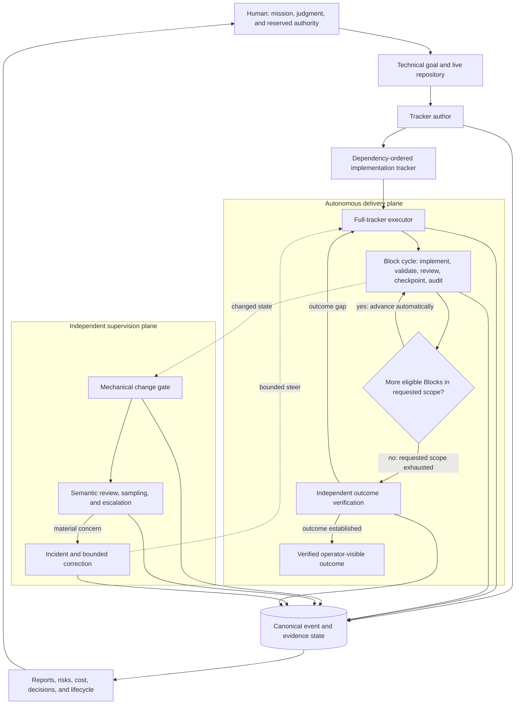

# Software Factory

**Autonomous, high-reliability software implementation for Codex**

Software Factory takes a technical objective and a live repository, derives a dependency-ordered implementation program, executes the requested tracker scope across hours or days with minimal routine human intervention, independently supervises changed state and corrective outcomes, and verifies the final operator-visible result.

[Video walkthrough](https://www.youtube.com/watch?v=gRJ-hgbBcTo) · [Generated supervision report](examples/reports/software_factory_report.pdf) · [Quick start](#quick-start) · [Architecture](#architecture)

> [!IMPORTANT]
> **One execution request can cover the entire remaining tracker.** [`implement-tracker-blocks`](implement-tracker-blocks/) can execute one Block, a dependency-safe range, or all remaining eligible Blocks. A Block is the system's unit of scope, acceptance, evidence, and recovery—not a required human pause.

| Requested scope | Internal control | Human role |
|---|---|---|
| One Block, a bounded range, or the full remaining tracker | Reconstruct, implement, validate, review where required, checkpoint, audit, close, and automatically advance through each eligible Block | Set the mission, retain genuinely reserved authority, and review consequential decisions and final outcome evidence |

**Block-by-Block is the factory's control granularity, not its autonomy limit.**

## Demonstrated operation

The recorded implementation program and included supervision window show two complementary parts of the system. These are observations from specific runs, not general benchmarks for Codex or software engineering.

### Multi-day implementation run

A single requested scope covered the complete tracker from Block 0 through Block 64.

| Measure | Observed result |
|---|---:|
| Requested tracker scope | Blocks 0–64 |
| Blocks executed | **65** |
| Execution time | Approximately **4 days** |
| Operator posture | Minimal routine human intervention; no turn-by-turn Block scheduling or re-prompting |
| Final test suite | **279 passing tests** |
| Final audit | **0 open Critical or High findings** |

The executor implemented, validated, reviewed where required, checkpointed, audited, and advanced through the program without requiring a human to restart the loop after each Block.

### Independent supervision window

| Measure | Observed result |
|---|---:|
| Report window | **71.42 h** |
| Scheduled monitoring time | **31.49 h** |
| Recorded target-read reliability | **92.39%** |
| Configured role threads | **8** |
| Semantic reviews | **156** |
| Incidents detected | **26** |
| Incidents reaching terminal outcomes | **26 / 26** |
| Median detection-to-resolution | **0.71 h** |
| P90 detection-to-resolution | **4.97 h** |
| High or Critical unresolved at cutoff | **0** |
| Projected API-equivalent supervision cost | **$32.80** |

### Generated supervision report

[](examples/reports/software_factory_report.pdf)

*Generated operational report, not a design mockup. Click the preview to open [`examples/reports/software_factory_report.pdf`](examples/reports/software_factory_report.pdf).*

The report is the human control surface for the run: it summarizes monitoring coverage, cost posture, active roles, incidents, response time, effectiveness, recurring failure classes, known blind spots, and evidence boundaries without requiring transcript-level supervision.

The independent control plane found issues that ordinary completion signals would not have exposed:

| Finding | What the control plane established |
|---|---|
| **Unnecessary evidence replay** | Routine monitoring rebuilt a **2,134-file** evidence envelope despite a current frozen baseline. The normal path was moved to cheap revision and root checks, with deep verification retained for actual currentness changes. |
| **Circular validation** | Producer and mechanical validator agreed because they shared classification logic. Independent semantic reconstruction kept promotion closed and later verified the corrected successor. |
| **Stale role activation** | A policy-hash mismatch exposed stale automation and role prompts. The repair changed only stale references and preserved schedules and role identities. |
| **False workflow stop** | A narrow historical no-rerun instruction had drifted into a durable prohibition. Mission-provenance review restored ordinary successor work without rewriting the mistaken history. |

> [!NOTE]
> The cost figure is a versioned API-equivalent projection, not provider telemetry or billed usage. Incident closure does not prove non-recurrence, and the report does not by itself establish the substantive quality of the monitored implementation.

## System at a glance

Software Factory combines three composable Codex skills with deterministic tracker verification, canonical event and incident state, weekly and terminal reporting, PDF rendering, and focused tests for the control invariants.

| Layer | Primary component | Responsibility |
|---|---|---|
| **Specification** | [`author-implementation-trackers`](author-implementation-trackers/) | Derive an implementation program from the live repository and its authoritative owners; define outcome, scope, dependencies, non-goals, acceptance, evidence, resource posture, decision boundaries, and terminal criteria. |
| **Autonomous execution** | [`implement-tracker-blocks`](implement-tracker-blocks/) | Execute one Block, a dependency-safe range, or the entire remaining tracker; validate, review, checkpoint, audit, and advance automatically through dependency order. |
| **Independent supervision** | [`supervise-tracker-runs`](supervise-tracker-runs/) | Perform mechanical change gating, independent semantic review, escalation, sampling, incident adjudication, bounded steering, and correction-effectiveness review. |
| **Outcome closure** | Executor and supervisor terminal controls | Reconcile current deliverables against the original objective and reopen the narrow owner when a green process record and the actual outcome disagree. |
| **Human governance** | Reports, lifecycle state, notices, decision packets, and optional Gmail | Present status, cost, response time, recurrence, blind spots, risks, and outcome evidence without requiring a human to read the full agent transcript. |

The skills remain independently useful: author a tracker without implementing it, execute a constrained Block range, run an entire compatible tracker without independent supervision, or attach supervision to a multi-day implementation program.

## Quick start

### 1. Install the skills

This repository is a **reference Codex skill tree**, not a packaged hosted service or plugin.

```bash
git clone https://github.com/estill01/software-factory.git
cd software-factory
mkdir -p "$HOME/.agents/skills"

for skill in \
  author-implementation-trackers \
  implement-tracker-blocks \
  supervise-tracker-runs
do
  ln -sfn "$(pwd)/$skill" "$HOME/.agents/skills/$skill"
done
```

Codex also supports repository-local `.agents/skills/` directories and follows symlinked skill folders. Invoke the skills as `$author-implementation-trackers`, `$implement-tracker-blocks`, and `$supervise-tracker-runs`. If a newly installed or updated skill does not appear, restart Codex. See the [Codex Skills documentation](https://developers.openai.com/codex/build-skills) for current discovery and distribution guidance.

### 2. Choose the operating mode

| Goal | Invocation | Behavior |
|---|---|---|
| Turn a technical objective into an executable implementation program | `$author-implementation-trackers` | Inspect the repository, derive the architecture-aware tracker, verify its structural invariants, and stop before implementation. |
| Execute the entire remaining tracker | `$implement-tracker-blocks` | Advance automatically through every eligible Block until outcome closure or a genuine non-delegable boundary. |
| Execute one Block or a bounded range | `$implement-tracker-blocks` with exact scope | Preserve the same evidence and acceptance controls, then stop at the requested boundary. |
| Add independent monitoring and incident follow-through | `$supervise-tracker-runs` from a separate thread | Observe changed state, review independently, route bounded correction, and verify later outcomes. |
| Run the complete system | Author → execute and supervise → verify outcome | Keep routine production autonomous while preserving human mission, reserved authority, and final oversight. |

### 3. Confirm the operating requirements

| Capability | Requirements |
|---|---|
| **Tracker authoring and execution** | Codex with local Skills support; Git; Python 3; a repository Codex can inspect and modify |
| **Independent supervision and reporting** | Python 3.11+ in a POSIX environment; independent Codex-thread access; scheduled automation or heartbeat support; access to the roles named by the supervision policy; `reportlab` for PDF generation |
| **Optional communication** | Gmail for project-scoped alerts, decision packets, roundups, replies, and report delivery; email is not required for authoring, execution, local incident state, or report generation |

```bash
python3 -m pip install reportlab
```

Review the environment-specific model aliases, schedules, and runtime bindings in the supervision policy before deploying the complete supervisor outside the reference environment.

### 4. Use a copyable prompt

#### Author an implementation tracker

```text
Use $author-implementation-trackers.

Inspect this repository and turn the following goal into an implementation-ready
tracker. Reuse the existing architecture and owners. Define observable completion,
dependency-ordered Blocks, scope and non-goals, acceptance criteria, evidence,
economical validation, independent-review boundaries, decision boundaries, and
explicit stop conditions. Do not implement the tracker.

Goal: {technical objective}
Tracker path: {path/to/tracker.md}
```

#### Execute the entire remaining tracker

```text
Use $implement-tracker-blocks to implement and audit the entire tracker at:

{path/to/tracker.md}

Start with the first incomplete eligible Block and continue through every remaining
Block in dependency order.

For each Block, reconstruct the live contract, implement the complete owned delta,
run focused and mapped validation, obtain distinct review where required, bind all
evidence to the exact candidate, create a bounded checkpoint commit, push when an
existing configured remote and repository policy permit it, audit the Block, and
automatically advance to the next eligible Block.

Do not pause for confirmation between Blocks. Treat each Block boundary as an
internal scope and acceptance boundary, not a user scheduling gate. If a genuinely
non-delegable input affects only part of the tracker, preserve that subject as
waiting and continue the maximal safe-work frontier.

Continue until the requested scope is exhausted and the original operator-visible
outcome has been independently verified, or until a real authority, safety,
credential, release, destructive-action, or external-dependency boundary prevents
further safe work. Do not merge, release, open a pull request, or perform destructive
cleanup unless separately authorized.
```

#### Execute one Block or a bounded range

```text
Use $implement-tracker-blocks to implement and audit {Block N / Blocks N-M} from:

{path/to/tracker.md}

Follow the tracker exactly, preserve unrelated work, reuse current accepted evidence,
bind validation and review to the exact candidate revision, checkpoint the bounded
slice when appropriate, and stop when the requested Block or range is complete.
Do not advance beyond the requested scope.
```

#### Attach independent supervision

```text
Use $supervise-tracker-runs.

Attach bounded supervision to the active implementation-tracker thread for this
project. Resolve the exact target thread, bind the current mission, monitor materially
changed states, route independent semantic review, detect drift and avoidable cost,
manage incidents through later outcome evidence, and keep the target thread as the
implementation authority. Keep Gmail integrations off unless explicitly enabled.
```

## Architecture



| Plane | Owns | Authority boundary |
|---|---|---|
| **Delivery** | Repository-aware implementation, validation, review, checkpointing, audit, and automatic advancement across the requested tracker scope | Does not redefine the mission or use process evidence alone to certify the final outcome |
| **Supervision** | Changed-state review, incident detection, escalation, bounded steering, sampling, and later correction-effectiveness review | Observes and steers; it does not take over ordinary implementation or rewrite the user's mission |
| **Evidence and human control** | Canonical events, incidents, policy state, deterministic metrics, evidence-bound synthesis, and verified report projections | Compresses supported state for governance; it does not turn attractive narration into a second source of truth |

## Operating model

| Stage | System contract | Completion gate |
|---|---|---|
| **1. Author** | Inspect the repository and convert the objective into dependency-ordered Blocks with owned scope, non-goals, deliverables, acceptance criteria, evidence, economy posture, decision boundaries, and stop conditions. | A maintained verifier confirms the tracker's structural invariants; implementation has not begun. |
| **2. Execute** | Reconstruct each eligible Block from live state, implement the smallest missing delta, validate and review the exact candidate, record evidence, checkpoint the slice, audit it, and advance automatically. | The current Block is accepted at its boundary; the executor activates the next eligible Block or begins terminal outcome verification. |
| **3. Supervise** | Route materially changed states through mechanical gating, independent semantic review, escalation and sampling, incident adjudication, bounded correction, and later effectiveness review. | A no-intervention state is supported, or the incident reaches a later evidence-backed terminal outcome. |
| **4. Close and report** | Return to the original objective, inspect or rehydrate current deliverables, compare expected effects with actual effects, challenge open items and artifact currentness, and project canonical evidence into reports. | The operator-visible outcome exists as requested; otherwise the narrow owning work is reopened. |

### Full-tracker execution loop

```text
bind original outcome-closure contract
        ↓
reconstruct current eligible Block
        ↓
inspect live repository and Git state
        ↓
identify smallest missing delta
        ↓
reuse current accepted evidence
        ↓
implement only the Block's owned scope
        ↓
validate and obtain required independent review
        ↓
record exact evidence and checkpoint the candidate
        ↓
audit and close the Block at its boundary
        ↓
requested scope complete?
   ├── no: activate the next eligible Block automatically
   └── yes: independently verify the operator-visible outcome
```

The Block stop boundary prevents scope bleed. It is an internal acceptance boundary, not necessarily a human handoff. A full-tracker run closes the current Block, rereads the next contract and live dependencies, and continues automatically.

When a narrow input is genuinely unresolved, the executor computes the affected dependency closure and continues the maximal safe-work frontier. One missing decision does not become a global stop unless the dependency graph actually requires it.

## Reliability model

| Production failure mode | Control applied by Software Factory |
|---|---|
| **A Block boundary becomes a human scheduling gate.** | Requested scope and Block control scope are represented separately, so full-tracker runs advance automatically after each accepted Block. |
| **The agent treats a task list as the architecture.** | Tracker authoring inspects the live repository, identifies authoritative owners, and splits work at real dependency, mutation, review, recovery, and stopping boundaries. |
| **Scope expands into attractive but unnecessary infrastructure.** | Every Block has one primary outcome, explicit non-goals, a feature-creep test, and a stop clause. |
| **Tests pass, so the project is declared complete.** | Tests, commits, hashes, audits, and ledgers remain process evidence; terminal closure separately inspects operator-visible deliverables and expected effects. |
| **Producer and validator share the same blind spot.** | Mechanical checks are separated from semantic review that can reconstruct governing facts independently, with escalation and sampling. |
| **The run repeatedly rescans or rebuilds unchanged work.** | Cheap currentness checks, accepted-evidence reuse, preflight, batching, and targeted invalidation precede expensive proof. |
| **One unresolved decision stalls everything.** | A genuine decision becomes a bounded dependency cut and the safe-work frontier is computed around it. |
| **A corrective action certifies itself.** | Incidents remain open until later target evidence shows whether the correction worked. |
| **The human must read thousands of agent turns to understand the run.** | Canonical event state is converted into deterministic metrics, evidence-bound synthesis, and verified human-readable reports. |

The result is **human-in-the-loop without requiring a human in every loop**: people retain mission, judgment, reserved authority, and final oversight while the machinery handles routine decomposition, execution control, changed-state review, incident follow-through, and reporting.

## Human control and reporting

The human interface is not the raw agent transcript. The reporting path deliberately separates computation, interpretation, and presentation.

| Layer | Function | Result |
|---|---|---|
| **Canonical operational state** | Preserve implementation, review, incident, lifecycle, policy, and reporting events with exact provenance. | Machine-readable source state |
| **Deterministic computation** | Compute bounded metrics, incident heads, activity, schedule posture, role counts, currentness, and resource estimates before narrative interpretation. | Canonical report data |
| **Evidence-bound cognitive review** | Interpret recurrence, blind spots, correction effectiveness, operating efficiency, supervisor behavior, and limitations without replacing the underlying evidence. | Supported synthesis |
| **Verified projections** | Render the same report state into JSON, Markdown, and charted PDF and verify agreement across projections. | Human-readable control surface |

At accepted terminal completion, the system can produce both:

| Report | Question answered |
|---|---|
| **Delta report** | What happened during the final reporting interval? |
| **Full-run report of reports** | What happened from implementation inception through accepted completion? |

Together they answer two separate questions:

1. **Did the resulting software satisfy the mission?**
2. **What happened inside the factory while producing it?**

## Repository map

| Path | Purpose |
|---|---|
| [`author-implementation-trackers/`](author-implementation-trackers/) | Tracker-authoring skill, agent definitions, references, assets, structural verifier, and verifier tests |
| [`implement-tracker-blocks/`](implement-tracker-blocks/) | Single-Block, bounded-range, and full-tracker execution contract plus supporting agent definitions |
| [`supervise-tracker-runs/`](supervise-tracker-runs/) | Independent supervision skill, role definitions, maintained policy, canonical event and incident tooling, weekly and terminal reporting, PDF rendering, and focused tests |
| [`examples/reports/software_factory_report.pdf`](examples/reports/software_factory_report.pdf) | Complete generated human-facing supervision report |
| [`examples/reports/software_factory_report_preview.png`](examples/reports/software_factory_report_preview.png) | Page-one README preview linked to the full report |
| [`README.md`](README.md) | System overview, operating model, architecture, evidence, and usage guidance |

Local supervision runtime state, generated Python bytecode, and Codex-managed system skills are intentionally excluded from version control.

## Development validation

```bash
SKILL_VALIDATOR="${CODEX_HOME:-$HOME/.codex}/skills/.system/skill-creator/scripts/quick_validate.py"

python3 "$SKILL_VALIDATOR" ./author-implementation-trackers
python3 "$SKILL_VALIDATOR" ./implement-tracker-blocks
python3 "$SKILL_VALIDATOR" .
